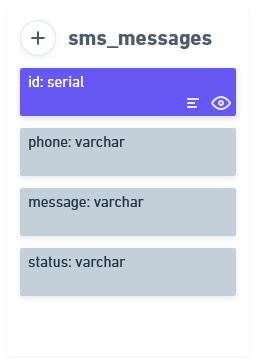

<h1 align="center">Desafio: Desenvolvedor Back-end Júnior</h1>

  <a href="#rocket-sobre-o-desafio">Sobre o desafio</a>&nbsp;&nbsp;&nbsp;|&nbsp;&nbsp;&nbsp;
  <a href="#calendar-entrega">Entrega</a>&nbsp;&nbsp;&nbsp;

# :rocket: Sobre o desafio
Para você já ir se aquecendo para o que está por vir, queremos propor um desafio para você.

Vamos supor uma aplicação que envia disparos de mensagens de SMS e registra esses disparos em um banco de dados. Queremos que você implemente um servidor que receberá atualizações de status dessas mensagens. A partir das regras de negócio definidas, você precisará construir uma API REST que realize a atualização das informações armazenadas em um banco de dados relacional e outra que busque os dados de mensagens no banco a partir do status da mensagem para exibir em um relatório.

**Atualização de status:** As mensagens de SMS são registradas no banco de dados e disparados por um sistema externo, que posteriormente envia uma requisição REST para atualizar o status da mensagem. Para isso, precisamos de uma API capaz de receber o ID do disparo e o status da mensagem e atualizar o registro no banco de dados.

**Relatórios de mensagens:** Para medir os resultados dos envios, temos uma aplicação que pesquisa os registros de disparo de acordo com o status da mensagem. Para que essa aplicação funcione corretamente, precisamos de uma API que seja capaz de receber um status e retornar todos os registros do banco de dados que estão marcados com esse mesmo status.

**Observações:** O desafio deve ser desenvolvido utilizando Javascript ou Typescript, sendo obrigatória a utilização de NodeJS.

## Regras de negócio
1. A atualização só pode ser realizada se a requisição para tal for válida. Para que uma requisição seja válida, o ID recebido deve ser puramente numérico e o status precisa ser válido (deve ser um dos seguintes: "ENVIADO", "RECEBIDO", "ERRO DE ENVIO").

2. Antes de atualizar o registro, a aplicação deve verificar se existe um registro com aquele ID no banco de dados.

3. A propriedade status estará inicialmente vazia.

## Dados
Para te ajudar a entender um pouco melhor, essa é a entidade da tabela sms_messages, necessária para você resolver o seu desafio.

  

# :calendar: Entrega
Para entregar esse desafio, você deve criar um repositório no **GitHub** contendo a sua implementação junto com as informações necessárias para rodar o seu projeto.

Em seguida, basta enviar o link do repositório para o email **dev.gi@precato.com.br** com o assunto **"Desafio desenvolvedor back-end júnior"**.

**Observações:** Não esqueça de deixar o repositório público para que possamos visualizar sua resolução. 😉