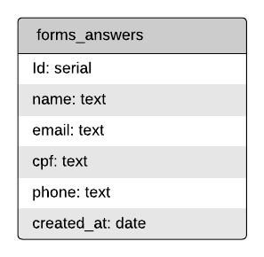

<h1 align="center">Desafio: Desenvolvedor Back-end Júnior</h1>

  <a href="#rocket-sobre-o-desafio">Sobre o desafio</a>&nbsp;&nbsp;&nbsp;|&nbsp;&nbsp;&nbsp;
  <a href="#calendar-entrega">Entrega</a>&nbsp;&nbsp;&nbsp;

# :rocket: Sobre o desafio
Para você já ir se aquecendo para o que está por vir, queremos propos um desafio para você.

Queremos que você implemente um servidor que recebrá inscrições de um formulário. A partir das regas de negócio definidas, você precisará construir uma API REST que realize a inscrição, caso esta seja válida, armamazenando as informações em um banco de dados relacional.

**- Inscrição no fluxo:** No sistema de captação de leads, temos um formulário de inscrição em um fluxo de mensagens com notícias e informações sobre os precatórios de nossos clientes. Para isso, precisamos de uma API capaz de receber a inscrição pelo formulário e registrá-la no banco dedados.

**- Relatórios de inscrição:** Para medir os resultados desse formulário, temos uma aplicação que pesquisa as inscrições dentro de um certo período de data e relaciona com os precatórios que compramos. Para que essa aplicação funcione corretamente, precisamos de uma API capaz de receber uma data inicial e uma data final e retorne todas as inscrições realizadas dentro desse período.

**- Observações:** O desafio deve ser desenvolvido utilizando Javascript ou Typescript, sendo obrigatória a utilização de NodeJS.

## Regras de negócio
1. A inscrição só deve ser feita com um email válido.

2. Não devem ser registradas linhas duplicadas com o mesmo email no banco de dados.

3. A propriedade "created_at" da tabela forms_answers deve ser preenchida com a data de inscrição do formulário.

## Dados
Para te ajudar a entender um pouco melhor, essa é a entidade da tabela forms_answers, necessária para você resolver o seu desafio.

  

# :calendar: Entrega
Para entregar esse desafio, você deve criar um repositório no **GitHub** contendo a sua implementação junto com as informações necessárias para rodar o seu projeto.

Em seguida, basta enviar o link do repositório para o email **dev.gi@precato.com.br** com o assunto **Desafio desenvolvedor back-end júnior**.

**- Observações:** Não esqueça de deixar o repositório público para que possamos visualizar sua resolução. 😉